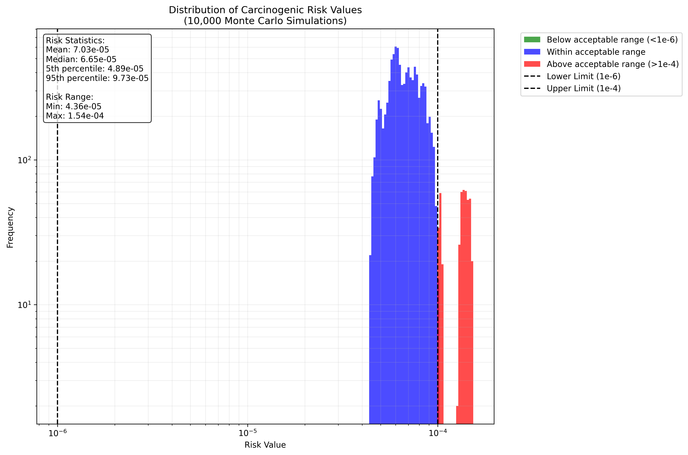
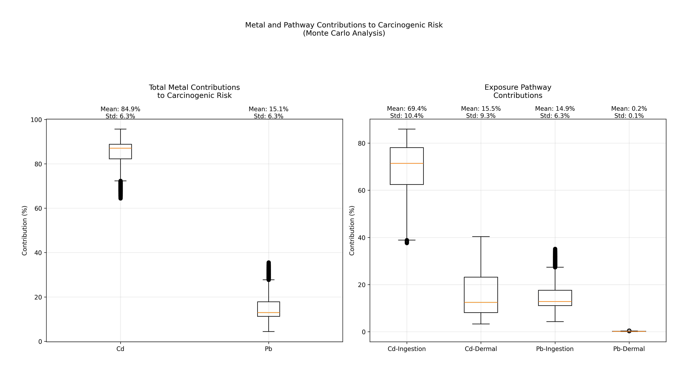

# Carcinogenic Risk Analysis Results

## Introduction
This analysis evaluates the carcinogenic health risks associated with exposure to heavy metals (Cadmium and Lead) in water samples. Using Monte Carlo simulation with 10,000 iterations, we assessed both the total risk levels and the relative contributions of each metal through different exposure pathways.

## Methodology
### Data Collection and Processing
- Analyzed 31 water sampling sites
- Measured concentrations of two heavy metals:
  - Cadmium (Cd)
  - Lead (Pb)
- Considered two exposure pathways:
  - Ingestion (drinking water)
  - Dermal contact (skin absorption)

### Risk Assessment Approach
1. **Monte Carlo Simulation**
   - 10,000 iterations to account for uncertainty
   - Stratified sampling (6 strata per dimension)
   - 20% variation factor to model real-world variability
   - Calculated both total risk and pathway-specific contributions

2. **Risk Evaluation Criteria**
   - Acceptable risk range: 10^-6 to 10^-4
   - Below 10^-6: Negligible risk
   - Above 10^-4: Requires intervention
   - Based on standard environmental health guidelines

## Results and Analysis

### 1. Risk Distribution Analysis

#### How to Read This Graph
- **X-axis**: Risk values on logarithmic scale
- **Y-axis**: Frequency of occurrence (also logarithmic)
- **Color Coding**:
  - Blue: Within acceptable range (10^-6 to 10^-4)
  - Red: Above acceptable range (>10^-4)
  - Green: Below acceptable range (<10^-6)
- **Vertical Lines**: Mark the acceptable range boundaries
- **Statistics Box**: Shows key numerical results

#### Key Findings
- **Central Tendency**:
  - Mean Risk: 7.03e-5
  - Median Risk: 6.65e-5
  - Most values cluster around 7e-5

- **Risk Range**:
  - Minimum: 4.36e-5
  - Maximum: 1.54e-4
  - 90% Confidence Interval: 4.89e-5 to 9.73e-5

- **Distribution Characteristics**:
  - Right-skewed distribution
  - Some values exceed the upper acceptable limit
  - No values below the lower acceptable limit
  - Majority falls within acceptable range

### 2. Metal and Pathway Contributions

#### How to Read These Plots
- **Left Plot (Total Metal Contributions)**:
  - Shows overall contribution of each metal
  - Box plots show distribution of contributions
  - Black dots represent outliers
  - Percentages at top show mean ± standard deviation

- **Right Plot (Pathway Contributions)**:
  - Breaks down contributions by metal and pathway
  - Shows relative importance of each exposure route
  - Allows comparison between pathways
  - Includes uncertainty in measurements

#### Detailed Findings

1. **Total Metal Contributions**
   - **Cadmium (Cd)**:
     * Dominant contributor: 84.9% ± 6.3%
     * Consistently high across samples
     * Relatively small variation (tight box plot)
   
   - **Lead (Pb)**:
     * Minor contributor: 15.1% ± 6.3%
     * Complementary to Cd contribution
     * Similar variation to Cd

2. **Exposure Pathway Analysis**
   - **Cadmium Pathways**:
     * Ingestion (69.4% ± 10.4%): Primary exposure route
     * Dermal (15.5% ± 9.3%): Significant secondary route
     * Combined pathways match total Cd contribution
   
   - **Lead Pathways**:
     * Ingestion (14.9% ± 6.3%): Main Pb exposure route
     * Dermal (0.2% ± 0.1%): Negligible contribution
     * Shows clear dominance of ingestion pathway

## Interpretation and Implications

### Risk Level Interpretation
1. **Overall Risk Status**:
   - Average risk (7.03e-5) falls within acceptable range
   - Some samples approach or exceed upper limit
   - Requires monitoring but not immediate intervention

2. **Distribution Pattern**:
   - Right-skewed distribution suggests occasional high-risk samples
   - Clustering below 10^-4 indicates generally manageable risk
   - No extremely low-risk samples suggests consistent exposure

### Metal Contribution Insights
1. **Cadmium Dominance**:
   - Clear primary risk driver (84.9%)
   - Both exposure pathways are significant
   - Suggests prioritizing Cd reduction strategies

2. **Lead Considerations**:
   - Secondary but notable contributor (15.1%)
   - Almost exclusively through ingestion
   - Dermal exposure negligible

### Exposure Route Analysis
1. **Ingestion Pathway**:
   - Dominant exposure route for both metals
   - Cd: 69.4% of total risk
   - Pb: 14.9% of total risk
   - Primary focus for risk management

2. **Dermal Exposure**:
   - Significant for Cd (15.5%)
   - Negligible for Pb (0.2%)
   - Secondary priority in risk management

## Recommendations

1. **Immediate Actions**:
   - Monitor samples exceeding 10^-4 risk level
   - Focus on reducing Cd concentrations
   - Prioritize ingestion exposure control

2. **Long-term Strategies**:
   - Implement Cd-specific treatment processes
   - Regular monitoring of both metals
   - Consider separate treatment for high-risk samples

3. **Risk Management Priorities**:
   - Primary: Reduce Cd ingestion exposure
   - Secondary: Address Cd dermal exposure
   - Tertiary: Monitor Pb levels

## Technical Notes
- Analysis performed using Python-based Monte Carlo engine
- Stratified sampling ensures comprehensive coverage
- 20% variation factor accounts for measurement uncertainty
- 10,000 iterations provide robust statistical confidence
- Results validated against actual sample measurements 